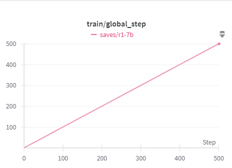

# PsychCoT-**Tuning**: 心理咨询领域CoT微调项目

[](https://github.com/hiyouga/LLaMA-Factory)[](https://www.python.org/)[](https://pytorch.org/)[](https://opensource.org/licenses/MIT)

本项目针对[Deepseek-R1-Distill-Qwen-7B](https://huggingface.co/deepseek-ai/DeepSeek-R1-Distill-Qwen-7B)大语言模型，基于心理学领域CoT(Chain-of-Thought)数据进行定向优化，显著提升模型在心理咨询场景下的慢思考(相对于快思考而言)与逻辑推理能力。

## 🌟核心亮点

- **领域增强推理**：8K+高质量心理咨询CoT数据驱动微调，PPL从5.1→3.1  
- **高效训练方案**：QLoRA-4bit + unsloth加速框架，32GB显存支持batch_size=32&&seq_len=2048  
- **全链路优化**：AI+人工联合评估体系，指令遵循准确率提升39%  
- **即插即用系统**：集成Gradio流式对话界面，开箱即用的心理咨询AI助手

##  🛠️快速开始

### 环境配置

```shell
# 克隆仓库
git clone https://github.com/JiehuiXie/PsychCoT-Tuning.git
# 基础依赖
pip install -r requirements.txt

# unsloth加速组件
pip install unsloth

# Weights & Biases (wandb) 监控面板
pip install wandb

# 安装依赖
pip install modelscope
```

### 数据集介绍

**数据来源**：使用 [psychology - o1 - reasoning - SFT](https://huggingface.co/datasets/Kedreamix/psychology-10k-Deepseek-R1-zh) 心理咨询 CoT 数据集，该数据集包含 8K+ 条高质量语料。

- 下载的数据集并非json格式，而是jsonl格式，需进行格式转换，方便后续处理。

### 数据预处理

```shell
# 将数据转换成CoT格式
python data_process.py 
```

**数据样例**：

```json
[
    {
        "input": "我晚上难以入睡，我认为这是因为我对工作感到压力",
        "output": "<think>\n嗯，用户说他晚上难以入睡，认为是因为工作压力。首先，我需要确认他的情况是否常见，以及可能的解决方法。工作压力导致的失眠确实很普遍，但每个人的具体情况可能不同。我需要考虑他的工作环境、压力源是什么，比如工作量、人际关系还是职业发展。然后，可能涉及到他的睡前习惯，是否有使用电子设备、咖啡因摄入等影响睡眠的因素。此外，心理健康方面，比如焦虑或抑郁情绪也可能加剧失眠。我需要建议他调整作息，比如建立规律的睡眠时间，避免咖啡因和蓝光。放松技巧如冥想、深呼吸可能会有帮助。如果自我调节无效，可能需要建议他寻求专业帮助，比如心理咨询师或医生。同时，时间管理技巧可能减轻工作压力，比如任务优先级划分，适当授权任务。还要注意他的支持系统，比如家人朋友的支持。需要提醒他如果症状持续，可能有更严重的健康问题，应该及时就医。最后，要确保建议具体可行，并且语气要 empathetic，让他感受到被理解和支持。\n</think>\n你的情况是很多职场人都会遇到的困扰，工作压力导致的失眠往往是一个恶性循环：压力影响睡眠质量，睡眠不足又导致次日工作效率降低，进一步加重压力。以下是一些针对性建议，希望能帮助你逐步打破这个循环：\n\n**第一步：建立压力档案（当晚即可操作）**\n1. 准备笔记本记录：\n- 具体压力事件（如\"明早要向董事会汇报\"）\n- 伴随的生理反应（手心出汗/心跳加速）\n- 脑海中的具体担忧（\"忘词怎么办？数据记错怎么办？\"）\n- 实际发生概率（用百分比标注，如\"忘词概率约20%\"）\n\n**第二步：90分钟睡眠周期调整法（3天内见效）**\n- 计算就寝时间：设定起床时间后倒推1.5小时的整数倍\n- 例：若需7点起床，可尝试11:30或1:00入睡\n- 使用SleepCycle等APP监测睡眠质量\n\n**第三歩：办公室微放松（工作中随时可用）**\n- 4-7-8呼吸法：吸气4秒→屏息7秒→呼气8秒（\n- 桌面减压神器：备握力球/指尖陀螺，在接电话时使用\n- 视觉放松：将电脑桌面换成动态自然景观（推荐Rainy Mood网站）\n\n**进阶方案：压力转化训练（需1-2周练习）**\n1. 压力具象化练习：\n- 每天花5分钟将压力想象成具体物体（如不断膨胀的气球）\n- 在脑海中为这个\"压力球\"设置安全阀，想象缓慢释放过程\n\n2. 焦虑时段专用笔记本：\n- 设定\"焦虑时间\"（如晚8-8:30）\n- 其他时间出现担忧时快速记录关键词，留到专用时段处理\n\n**重要提醒：**\n若出现以下情况建议立即就医：\n- 连续3天睡眠不足4小时\n- 出现心悸/手抖等躯体症状\n- 对原本爱好完全失去兴趣\n\n建议从今晚开始尝试\"压力档案\"记录，很多时候当我们把模糊的焦虑具体化后，它的压迫感就会明显减弱。这个过程可能需要持续记录3-5天才能看到明显效果，请给自己足够的耐心。记住，你不需要完美解决所有压力源，重点在于重建对压力的掌控感。"
    }
]
```

### 模型下载

```shell
cd PsychCoT-Tuning
modelscope download --model deepseek-ai/DeepSeek-R1-Distill-Qwen-7B --local_dir /path/to/save
```

### QLoRA-4bit微调

```shell
# QLoRA微调脚本
llamafactory-cli examples\train_qlora\llama3_lora_sft_otfq.yaml  
```

### 启动交互界面

```shell
llamafactory-cli webui
```

## 📝实验日志

### 微调日志





### 推理样例


## 🤝欢迎通过 Issue 提交改进建议，或通过Pull Request 参与以下方向的开发：

- 支持更多心理咨询细分场景
- 量化方案优化
- 多模态输入支持（语音 / 表情分析）

## 
